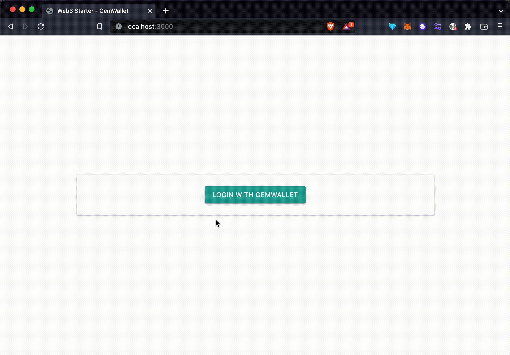
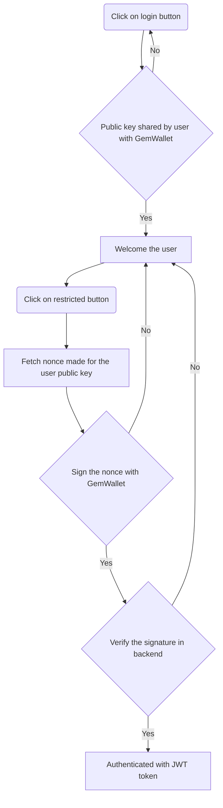

# GemWallet - XRPL Web3 Authentication

## Introduction

:warning: Don't forget to install [GemWallet](https://gemwallet.app)

This repository is showcasing how to create a web3 login (authentication) on the XRPL (XRP Ledger) thanks to GemWallet.

## How does the web3 authentication works?

Here is an high level flow diagram on how the flow within this repository is developed:

## Available Scripts

In the project directory, you can run:

### `npm start`

Runs the app production mode.

### `npm dev`

Run the hot-reload nodemon server to enhance the developer experience while coding within this repository.
